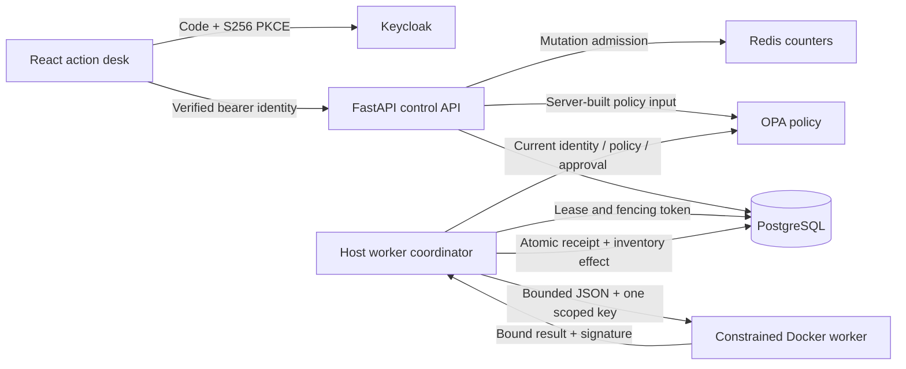
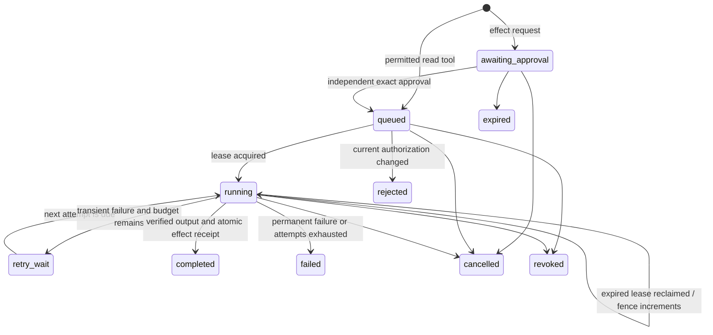

# Architecture

## Request and approval boundary

A request binds its tenant, caller, effective roles, account generation, immutable tool snapshot, active tool generation, canonical arguments, argument digest, policy revision, approval requirement and expiry. The API derives identity from a verified bearer token and the current local account. Callers cannot submit their tenant, role or user authority in a request body.

OPA receives only server-built authority and trusted handler risk. Free-form tool descriptions never grant permissions. An effect requires an independent approver even if a policy response incorrectly reports that approval is unnecessary. Approval binds the exact request, reviewer account generation and a maximum five-minute lifetime. Requests expire after one hour.

Authority is checked at submission, approval, lease acquisition and effect completion. Account revocation, tool activation generation changes, policy revision changes, expiry and approval revocation all prevent a subsequent effect. Time is re-read after remote policy calls; a decision that crossed an expiry boundary is rejected.

The diagram omits some equivalent terminal transitions for readability. A terminal request cannot be reapproved; create a new request with a new idempotency key.

## Ownership and durable effects

Every execution receives a 60-second lease, random token, worker owner and monotonically increasing fence. Only the current unexpired owner may finalize a run. The normal worker deadline is ten seconds and can be configured up to thirty seconds. Three execution attempts are allowed; transient execution backoff is two, four and then terminal failure at the third attempt. Pre-claim policy outages have a separate bounded durable deferral budget so one unavailable request does not starve unrelated tenants.

The sandbox cannot write inventory. It returns a protocol-bound signed reservation intent that the host verifies against the exact request and selected credential. The coordinator then rechecks authority and commits stock, reservation, receipt, completion identity and audit event in one PostgreSQL transaction. A crash before commit leaves no effect. A replay with the same completed lease and output returns the existing receipt; a different lease or result is rejected.

The database uses a document table with `(tenant, kind, key)` as its primary key. The PostgreSQL adapter takes an advisory transaction lock for every mutation, including registry/account changes and effect completion. This deliberately serializes the demonstration and closes cross-process TOCTOU windows. Long policy calls can reduce throughput. Reads and audit history are not designed for unbounded datasets. SQLite provides the deterministic local test adapter; the running service uses PostgreSQL.

## Sandbox and credentials

Handlers are installed code: `sha256`, `sign_report` and `reserve_inventory`. A registry manifest can select an installed handler and constrain its input contract. It cannot select a command, image, mount, network destination or credential alias. The worker independently validates its fixed handler input and response protocol; incompatible published schemas result in rejected work rather than expanded authority.

Each worker receives a read-only root filesystem, no network, non-root host UID/GID, no Linux capabilities, no privilege escalation, 64MiB memory and swap, 0.25CPU, 32 processes, an 8MiB temporary filesystem and 64 file descriptors. Output is bounded to64KiB. Credentials are separate private files; only the selected tool's file is mounted at `/run/credential/key`, outside environment variables. Workers never receive the Docker socket or database access.

The host coordinator has Docker privileges and validates all container arguments itself. Containers constrain this trusted handler demonstration; they are not a hostile-kernel sandbox. A host process crash can leave a container for operator cleanup. Lease fencing still prevents that abandoned computation from committing an effect. See the runbook for inspecting and removing only abandoned `keel-worker` containers.

## Identity, audit and browser state

The API validates RSA signatures, fixed issuer/audience, access-token type, authorized client and expiry. Local account roles intersect token roles on every API call and again inside security-sensitive mutations. Registry administration re-reads the account inside its mutation transaction, so a cached token cannot outlive local revocation.

Browser access, refresh and ID tokens remain in memory. Only the one-use PKCE transaction is stored in session storage. ID token nonce/signature/issuer/audience are verified using WebCrypto; a refresh cannot change subject or resurrect a signed-out generation. API token verification is independent of browser checks. A full page reload requires sign-in again; the issuer may still have a valid SSO session until the user signs out.

Audit events are append-only through the application and form a per-tenant hash chain. Event details redact sensitive key names and secret literals supplied to the redactor; requests intentionally retain their arguments for human review. Do not send secrets as ordinary tool arguments. Database administrators can rewrite an entire chain, so the chain is integrity evidence within this trust boundary, not externally anchored tamper proof storage.
